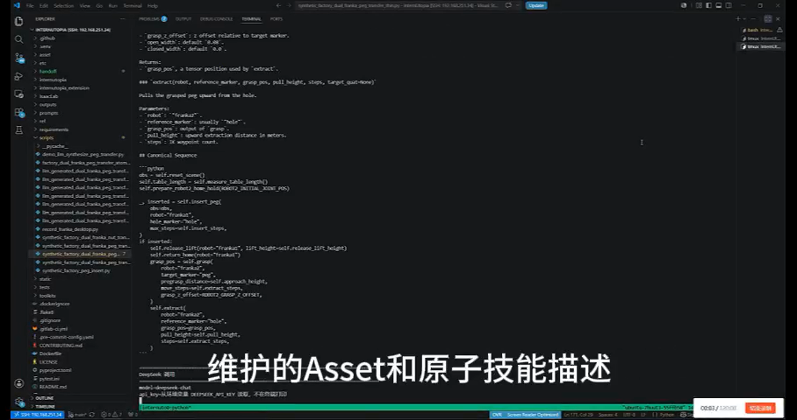

# Factory Dual-Franka Transfer Bundle

This bundle contains the task code and assets for the IsaacLab dual-Franka
peg-transfer and nut-transfer synthetic-data tasks. The checkpoint is hosted
separately on HuggingFace.

## Contents

- `scripts/synthetic_factory_dual_franka_peg_transfer_thin.py`
  - RobotWin-style thin entrypoint for the dual-Franka peg-transfer task.
- `scripts/synthetic_factory_dual_franka_nut_transfer_thin.py`
  - RobotWin-style thin entrypoint for the dual-Franka nut-transfer task.
  - Franka2 closed gripper width is fixed at `0.01`.
  - Franka2 nut grasp height is shifted down by `5 mm`.
- `scripts/factory_dual_franka_peg_transfer_atomic_skills.py`
  - Shared task-level skills used by both thin entrypoints.
- `scripts/demo_llm_synthesize_peg_transfer.py`
  - Terminal-first LLM demo: natural-language task description -> atomic skill prompt -> generated task script -> IsaacLab rollout -> HDF5/MP4 output.
- `prompts/factory_dual_franka_peg_transfer_atomic_skills.md`
  - Atomic skill interface and canonical sequence passed to the LLM.
- `demo/LLM_generate_data.mp4`
  - Screen-recorded demo of the end-to-end LLM synthesis flow.
- `demo/LLM_generate_data_preview.png`
  - Clickable preview image used by the README to link to the demo video.
- `internutopia_extension/tasks/synthetic_base_task.py`
  - Checkpoint loading, reset, recording, HDF5, and MP4 helpers.
- `internutopia_extension/tasks/isaac_motion_primitives.py`
  - Reusable motion primitives: hold, joint trajectory, robot2 grasp, pull,
    gripper, wrist twist, release lift, and Factory IK.
- `internutopia_extension/tasks/factory_dual_franka_env.py`
  - Dual-Franka Factory scene, desk005 placement, D455 wrist-camera USD setup,
    and Gym registration for peg and nut tasks.
- `asset/desk005/`
  - Desk USD and material resource used by the task.
- `asset/factory/`
  - Local copies of IsaacLab Factory USD assets downloaded from the Isaac 4.5 cloud asset source: `factory_hole_8mm.usd`, `factory_peg_8mm.usd`, `factory_nut_m16.usd`, `factory_bolt_m16.usd`, and `franka_mimic.usd`.
- `asset/franka/` and `asset/ur5e_robotiq/`
  - D455 wrist-camera wrapper and payload assets used by `franka1_d455` and
    `franka2_d455` recording modes.

## Expected Repo Layout

Put this bundle's contents at the root of an InternUtopia checkout that also
has:

```text
IsaacLab/
isaacsim installed at /data/user/isaacsim, or ISAAC_PATH set correctly
```

The task script adds these IsaacLab source directories to `sys.path`:

```text
IsaacLab/source/isaaclab
IsaacLab/source/isaaclab_assets
IsaacLab/source/isaaclab_mimic
IsaacLab/source/isaaclab_rl
IsaacLab/source/isaaclab_tasks
```

## Run Peg Transfer

From the repo root:

```bash
source /data/user/miniconda3/etc/profile.d/conda.sh
conda activate internutopia
source /data/user/isaacsim/setup_conda_env.sh
python scripts/synthetic_factory_dual_franka_peg_transfer_thin.py \
  --num_envs 1 \
  --device cuda:0 \
  --headless \
  --disable_fabric \
  --checkpoint checkpoints/Factory/test/nn/Factory.pth \
  --video_frame_repeat 1 \
  --hold_steps 8
```

The script writes HDF5 and MP4 files to:

```text
outputs/factory_dual_franka_peg_transfer_thin/
```

## Run Nut Transfer

From the repo root:

```bash
source /data/user/miniconda3/etc/profile.d/conda.sh
conda activate internutopia
source /data/user/isaacsim/setup_conda_env.sh
python scripts/synthetic_factory_dual_franka_nut_transfer_thin.py \
  --num_envs 1 \
  --device cuda:0 \
  --headless \
  --disable_fabric \
  --checkpoint checkpoints/Factory/test/nn/Factory.pth \
  --record_camera franka2_d455 \
  --video_frame_repeat 1 \
  --output_dir outputs/factory_dual_franka_nut_transfer_rl_debug \
  --wrist_camera_rotate_zyx 0 90 180
```

The script writes HDF5 and MP4 files to the `--output_dir` path.

## LLM End-to-End Data Synthesis Demo

[](demo/LLM_generate_data.mp4)

[Download or watch the LLM demo video](demo/LLM_generate_data.mp4)

The demo shows the full terminal flow:

1. Print the natural-language task request.
2. Print the atomic skill spec sent to the LLM.
3. Generate a runnable `play_once` and scene setup script.
4. Run the generated IsaacLab script.
5. Print whether synthesis succeeded and where the HDF5/MP4 files were saved.

Set the LLM key through an environment variable. Do not hard-code it:

```bash
export DEEPSEEK_API_KEY="your_key_here"
```

Example reusable natural-language request:

```text
请合成一段双机械臂具身数据：两个 Franka 机械臂相对而立于桌面两侧，桌面中央有一个 hole。Franka1 初始手持 peg，并将 peg 插入 hole 中；随后 Franka1 松开并回到初始位姿，Franka2 移动到 peg 上方，抓取已经插入的 peg，并将 peg 从 hole 中取出。请使用当前 Factory dual-Franka 场景、原子技能接口和 HDF5/MP4 记录格式生成可运行脚本。
```

Run the demo from the repo root:

```bash
source /data/user/isaacsim/setup_conda_env.sh
python scripts/demo_llm_synthesize_peg_transfer.py \
  --request "请合成一段双机械臂具身数据：两个 Franka 机械臂相对而立于桌面两侧，桌面中央有一个 hole。Franka1 初始手持 peg，并将 peg 插入 hole 中；随后 Franka1 松开并回到初始位姿，Franka2 移动到 peg 上方，抓取已经插入的 peg，并将 peg 从 hole 中取出。请使用当前 Factory dual-Franka 场景、原子技能接口和 HDF5/MP4 记录格式生成可运行脚本。" \
  --run
```

For a no-network smoke test that still prints the same terminal sections and uses the known-good task template:

```bash
source /data/user/isaacsim/setup_conda_env.sh
python scripts/demo_llm_synthesize_peg_transfer.py --offline --run
```

Generated task scripts are written to:

```text
scripts/llm_generated_dual_franka_peg_transfer_<timestamp>.py
```

Generated datasets/videos are written to:

```text
outputs/llm_demo/factory_dual_franka_peg_transfer/
```

## Checkpoint

The checkpoint is not stored in this GitHub repository. Download it from:

```text
https://huggingface.co/Heiheiheidashuai/factory_dual_franka_peg_transfer_ckpt
```

Place `Factory.pth` at:

```text
checkpoints/Factory/test/nn/Factory.pth
```

The latest verified command produced:

```text
inserted: true
success: true
```

For nut transfer, the current script records the transfer rollout after Franka1
threads the nut and Franka2 grasps, reverse-twists, lifts, and returns home.
